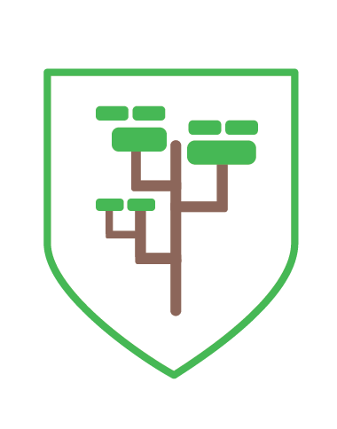

# AFIP - ASTs Fantastic Infosec Pilgrim

<p align="center">
  
</p>

Detect vulnerabilities with this SAST for Groovy!

If you need to know the details of how this works on a technical level, please refer to [this project docs](scanner/docs/arch.md).


## Docker image

You first need the build the docker images. Before building, complete the *env.list*  with your own github keys if you wish to scan private repositories.

Then you may run:

```bash
docker build -t afip-playground ./playground && docker build -t afip-example-api ./example-api && docker build -t afip-scanner ./scanner
```

Then you can run the Scanner, the Playground and the example API with:

```bash
docker-compose up -d
```

Access to the API on _http://localhost:8000_. Access to the Playground on _http://localhost:8080_

## AFIP Playground

The AFIP [Playground](playground/README.md) is a small frontend where you can test out snippets of code against several vulnerabilities.

### Usage

1. Select a vulnerability against which you want to test your code.

2. Load a snippet of code you want to analyze. You can use the Example button to load an example snippet for the selected vulnerability.

3. Analyze the code and see the results obtained. Results are color coded: green means a previously dangerous variable has been cleaned, yellow indicates a tainted variable and red indicates a tainted variable which has reached a dangerous function (ie: a vulnerability.)

## Example API

**Warning!** The example API is NOT INTENDED FOR USAGE IN PRODUCTIVE SYSTEMS. It is though extensively
documented so feel free to base your design on it. 

The API is a simple server to exemplify how should the interface between the Scanner and the API be. The API can be reached at _http://localhost:8000_ and the Scanner is configured to make requests too this endpoint. To request a scan a POST request must be sent to the API specifying the Github repository to be scanned and the tags you wish to scan. If the project has no tags, you may send a branch name like 'master' and it should scan the last commit of that branch.

```json
{
	"data": {
    	"type": "scanRequest",
    	"attributes": {
			"repositoryURL": "https://github.com/:user/:repository",
			"tags": ["example-tag"]
    	}
	}
}
```

The API will respond to this message with the scan ID and the results for the scan can be accessed at the path */scans/results/:id* using the received ID. If no ID is specified the response will contain the results for all scans done.

### Example usage
Interactions with the API look something like this:
```bash
$ curl -X POST http://localhost:8000/scans/queue -d '{"data": {"type": "scanRequest", "attributes": {"repositoryURL": "https://github.com/dima767/grails-crowd/", "tags": ["v1.3.3"] } } }' -H 'Content-Type: application/json'
{"data":{"type":"acceptedScan","attributes":{"scanID":"8yecwoyab2c"}}}%

$ curl -X GET http://localhost:8000/scans/results/8yecwoyab2c
```

## Interface Scanner - API

The AFIP Scanner requires an API from which it will request the scans to perform and then post the results to.

The Scanner makes continuos request to the API at the path */scans/queue*. From this endpoint the Scanner will get the queued scans to start scanning the first one of the list. The message format that requires to be sent to the Scanner in the response is show in the example API. In this message the commit URL and the callback URL for posting the results are set.

Next the Scanner will send a commit message to the API, letting it know that the Scanner is taking care of the corresponding scan. The commit URL can be specified for each scan, in the example api it is set at */scans/queue/:id* where the id corresponds to that of each given scan.

Finally, the Scanner will post the results back to the API whether it is the vulnerabilities found or reporting any failure in the scans. In the example api this path is set to */scans/results*, the callback url can be set in the response to */scans/queue*.

## Create New Detectors

We provide a Python 3 script *vuln_creator.py* that helps create new detectors, which is accompanied by a list of vulnerabilities in the file *vulns.json*. To add a new detector fill in the *vulns.json* file with the new vulnerablity you want to create and run the script *vuln_creator.py*.
This will create three template files in the AFIP Scanner. For a *NewVuln* the files created will be:

'''
scanner/src/groovy/afip/detectors/NewVulnDetector.groovy
scanner/src/groovy/afip/vulns/NewVuln.groovy
scanner/src/tests/NewVulnTests.groovy
'''
To run it:
```bash
python3 vuln_creator.py
```

## Credits

* Joaquin L. Pereyra
* Patricio Sabogal
* Philippe Clavier
* Nicolas Lantez

Also worth mentioning are Jonatan Cisneros and Alejandro Iacobelli for their innumerable ideas and informal collaborations.

<p align="center">
  
</p>

>_Patito did a lot of late-stage work on the project and left the team to follow a dream just before it went open source. We love you Patito! Good luck in your adventures._

## Questions
You may post an issue here or send an email to [Joaquin](joaquin.pereyra@mercadolibre.com) or [Philippe](philippe.clavier@mercadolibre.com)

## License

Licensed under the Apache License, Version 2.0 (the "License"); you may not use this file except in compliance with the License.
You may obtain a copy of the License [here](http://www.apache.org/licenses/LICENSE-2.0).
